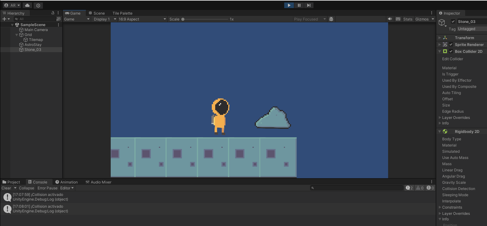

# FDV_MapasYF-sicas

Se han empleado los siguientes assets:
 - Free Pixel Space Platform Pack
 - PolyMeshWorld

## Punto 1 : Crear una escena donde ver las siguientes situaciones

### Ninguno de los objetos será físico.

### Un objeto tiene físicas y el otro no.

### Ambos objetos tienen físicas.

### Ambos objetos tienen físcas y uno de ellos tiene 10 veces más masa que el otro.

### Un objeto tiene físicas y el otro es IsTrigger.

### Ambos objetos son físicos y uno de ellos está marcado como IsTrigger.

### Uno de los objetos es cinemático.

## Punto 2 : Aplicar Restricciones

### Objeto estático que ejerce de barrera infranqueable | Zona en la que los objetos que caen en ella son impulsados hacia adelante

### Objeto que es arrastrado por otro a una distancia fija

### Objeto que al colisionar con otros sigue un comportamiento totalmente físico.

### Incluye dos capas que asignes a diferentes tipos de objetos y que permita evitar colisiones entre ellos.

